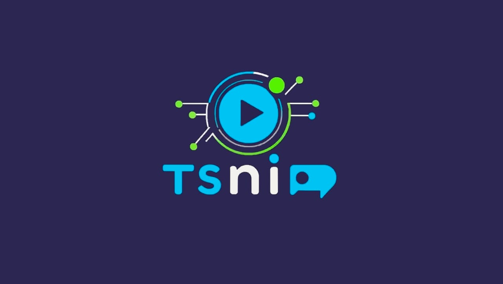
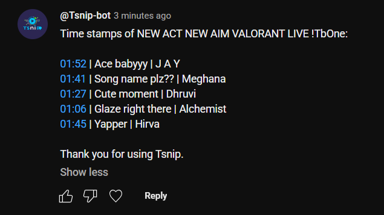
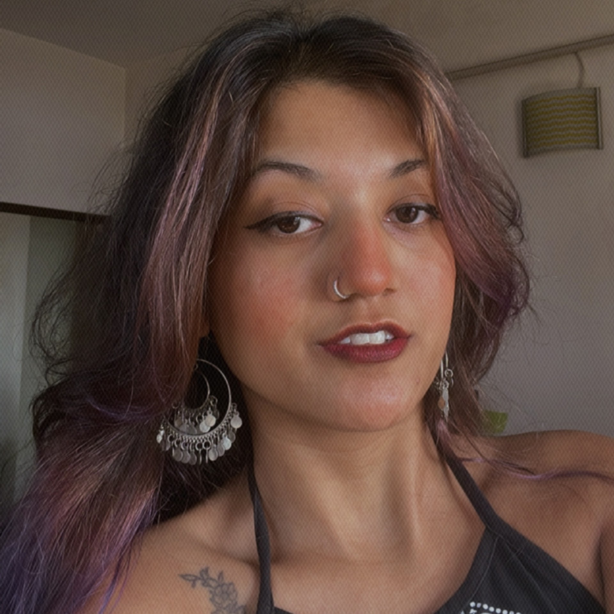

# 🎬 Tsnip

<div align="center">
  
  
  **Automated Timestamping for YouTube Live Streams**
  
  *Making highlights creation effortless for creators and viewers*
</div>

---

## 🚀 Why Tsnip?

Tsnip revolutionizes how you handle YouTube live streams by automatically timestamping key moments during your broadcast. After your stream ends, our intelligent bot comments all collected timestamps, making it incredibly valuable for:

- **📺 Offline Viewers** - Easily navigate to the best moments
- **✂️ Content Editors** - Quickly identify highlight-worthy segments
- **🎯 Content Creators** - Boost engagement with organized content

### 🔒 **Completely Secure & Free**
- ✅ **100% Open Source** - Full transparency
- ✅ **No YouTube Login Required** - Your channel stays secure
- ✅ **Zero Cost** - Free forever
- ✅ **Privacy First** - No data collection

---

## ⚙️ How to Integrate Tsnip?

### Prerequisites
You'll need **Nightbot** set up on your channel. If you haven't done this yet, follow this simple guide:  
📹 [How to Setup Nightbot](https://youtu.be/R2f7ZWyiGZw?si=MsdXM0j3pbHmFFsR)

### Integration Steps

1. **Add the Command** - Paste this in your YouTube live chat:

```
!addcom !ts $(urlfetch https://tsnip.vercel.app/api/clip?user=$(user)&chatId=$(chatid)&channelid=$(channelid)&msg=$(querystring)&delay=22)
```

2. **Set User Permissions** (Recommended) - To prevent spam, change the **Required User-Level** to **Moderator** in Nightbot settings.

3. **Customize Delay** - Adjust the `delay=22` parameter based on your stream setup:

| Stream Type | Recommended Delay | Use Case |
|-------------|------------------|----------|
| **Low Latency** | `delay=22` | Real-time interaction |
| **Medium Latency** | `delay=42` | Balanced performance |
| **High Latency** | `delay=58` | Stream sniper protection |

### 📝 How to Create Timestamps

Once integrated, you and your viewers can create timestamps using these commands:

| Command | Description | Example |
|---------|-------------|---------|
| `!ts` | Creates timestamp with no title | Simple moment capture |
| `!ts Nice Flick Shot` | Creates timestamp with custom title | Titled as "Nice Flick Shot" |

**💬 Confirmation**: After a successful timestamp, you'll see a response from Nightbot confirming the action.

> 💡 **Pro Tip**: The delay compensates for the time difference between your live stream and when viewers see it in chat.

---

## 🎯 How It Works

After your live stream ends, within **2 minutes** our bot will automatically comment with all collected timestamps:

<div align="center">
  
</div>

*The bot organizes all timestamps chronologically, making navigation effortless for your audience.*

---

## 🌟 Trusted by Creators

<div align="center">
  <div style="display: inline-block; text-align: center; margin: 20px;">
    
    <br>
    <strong><a href="https://www.youtube.com/@kiwi_fps" target="_blank" style="text-decoration: none; color: #4CAF50;">@kiwi_fps</a></strong>
    <br>
    <em style="font-size: 0.9em; color: #666;">Professional Player</em>
  </div>
</div>

*Join the growing community of streamers who trust Tsnip for their timestamping needs!*

---

## 🛠️ Tech Stack

Tsnip is built with modern, reliable technologies:

| Component | Technology | Purpose |
|-----------|------------|---------|
| **Backend** | Python | Core application logic |
| **Deployment** | Vercel | Serverless hosting platform |
| **Database** | Supabase | Real-time database & storage |
| **Scheduling** | Cron-job.org | Automated timestamp processing |

*Built for performance, scalability, and reliability.*

---

## 💝 Support Tsnip

### Why Support Us?
Your support helps us:
- 🖥️ **Cover Infrastructure Costs** - Keep servers running smoothly
- 📈 **Scale Reliably** - Handle growing user base
- 🔧 **Continuous Improvements** - Add new features and fixes

### 💰 Monetary Support

<div align="center">
  <table>
    <tr>
      <td align="center">
        <br>
        <strong>UPI Payment</strong><br>
        <code>technoguys037493@okaxis</code>
      </td>
      <td align="center">
        <br>
        <strong>Buy Me a Coffee</strong><br>
        <a href="https://buymeacoffee.com/jaypatel208">☕ Support Here</a>
      </td>
    </tr>
  </table>
</div>

### 🆓 Free Support Options
Can't support monetarily? No worries! Here's how you can help:
- 📢 **Share** with fellow streamers
- 🗣️ **Give shoutouts** during your streams  
- ⭐ **Star** this repository
- 💬 **Spread the word** on social media

*Free publicity is just as valuable to us! ❤️*

---

## 📞 Contact & Support

Got questions, suggestions, or need help? Reach out to us:

- **📧 Email**: [workbyjd@gmail.com](mailto:workbyjd@gmail.com)
- **💬 Discord**: `jd.208`
- **💼 LinkedIn**: [jaypatel208](https://www.linkedin.com/in/jaypatel208/)

---

## 📄 License

This project is licensed under the MIT License - see the [LICENSE](LICENSE) file for details.

---

<div align="center">
  <strong>Made with ❤️ for the YouTube Creator Community</strong>
  
  If Tsnip helps your content creation journey, consider giving us a ⭐!
</div>