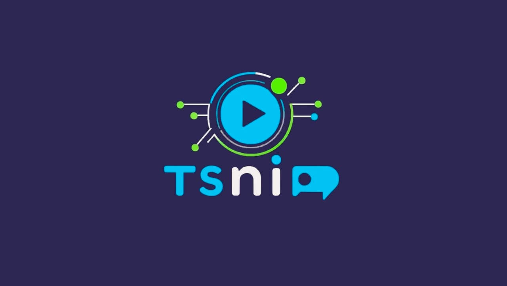
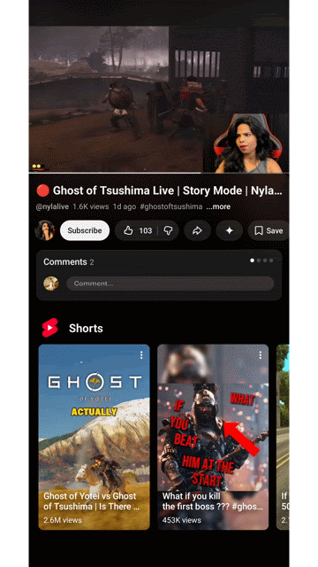
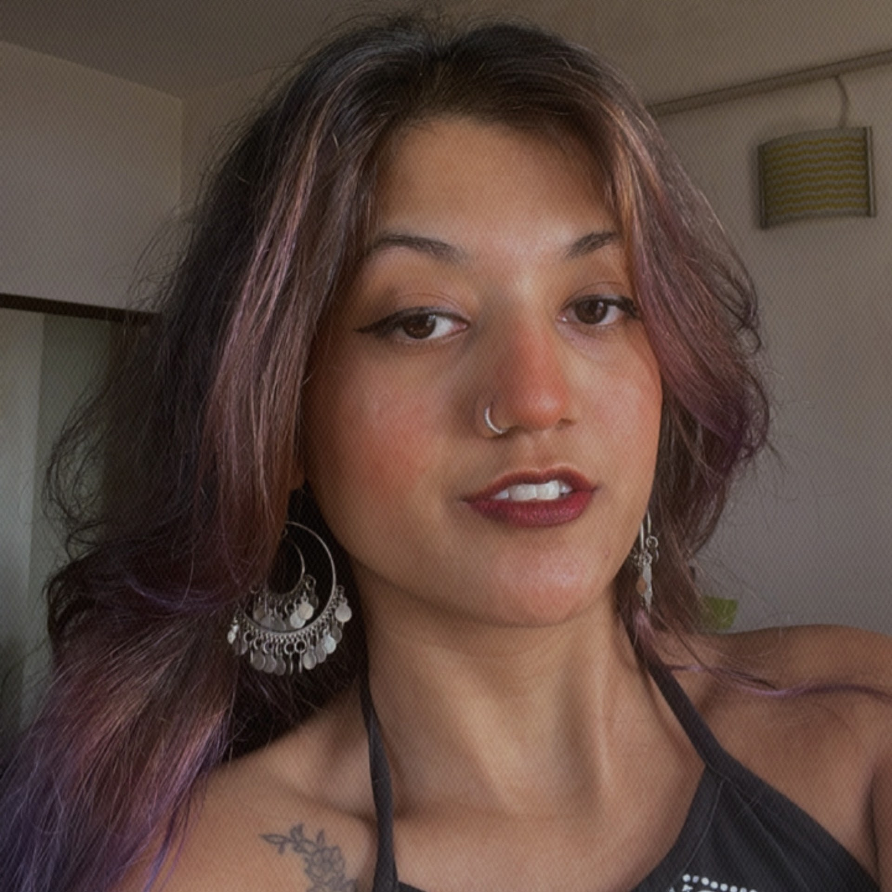

# 🎬 Tsnip

<div align="center">
  
  
  **Automated Timestamping for YouTube Live Streams**
  
  *Making highlights creation effortless for creators and viewers*

  📖 [Read the full story on Medium ](https://tinyurl.com/3kkvj7ua) - Learn about the journey behind Tsnip
</div>

---

## 🚀 Why Tsnip?

Tsnip revolutionizes how you handle YouTube live streams by automatically timestamping key moments during your broadcast. After your stream ends, our intelligent bot comments all collected timestamps, making it incredibly valuable for:

- **📺 Offline Viewers** - Easily navigate to the best moments
- **✂️ Content Editors** - Quickly identify highlight-worthy segments
- **🎯 Content Creators** - Boost engagement with organized content

### 🔒 **Completely Secure & Free**
- ✅ **100% Open Source** - Full transparency
- ✅ **No YouTube Login Required** - Your channel stays secure
- ✅ **Zero Cost** - Free forever
- ✅ **Privacy First** - No data collection

---

## ⚙️ How to Integrate Tsnip?

### Prerequisites
You'll need **Nightbot** set up on your channel. If you haven't done this yet, follow this simple guide:  
📹 [How to Setup Nightbot](https://youtu.be/R2f7ZWyiGZw?si=MsdXM0j3pbHmFFsR)

### Integration Steps

1. **Add the Command** - Paste this in your YouTube live chat:

```
!addcom !ts $(urlfetch https://tsnip.vercel.app/api/clip?user=$(user)&chatId=$(chatid)&channelid=$(channelid)&msg=$(querystring)&delay=22)
```

2. **Set User Permissions** (Recommended) - To prevent spam, change the **Required User-Level** to **Moderator** in Nightbot settings.

3. **Customize Delay** - Adjust the `delay=22` parameter based on your stream setup:

| Stream Type | Recommended Delay | Use Case |
|-------------|------------------|----------|
| **Low Latency** | `delay=22` | Real-time interaction |
| **Medium Latency** | `delay=42` | Balanced performance |
| **High Latency** | `delay=58` | Stream sniper protection |

### 📝 How to Create Timestamps

Once integrated, you and your viewers can create timestamps using these commands:

| Command | Description | Example |
|---------|-------------|---------|
| `!ts` | Creates timestamp with no title | Simple moment capture |
| `!ts Nice Flick Shot` | Creates timestamp with custom title | Titled as "Nice Flick Shot" |

**💬 Confirmation**: After a successful timestamp, you'll see a response from Nightbot confirming the action.

> 💡 **Pro Tip**: The delay compensates for the time difference between your live stream and when viewers see it in chat.

---

## 🎯 How It Works

After your live stream ends, within **30 minutes** our bot will automatically comment with all collected timestamps:

<div align="center">
  
</div>

*The bot organizes all timestamps chronologically, making navigation effortless for your audience.*

### 🔍 Finding the Bot Comment

Since our bot comments on multiple streams in a similar format, YouTube may flag it as spam and hide it by default. To find the comment, simply **sort comments by "Newest first"** on the stream — the bot's comment will be right there:

<div align="center">
  
</div>

> 💡 **Pro Tip for Creators**: Add our bot as an **approved user** on your channel. Once the bot comments, **pin that comment** and engage with it (like/reply). A pinned comment is visible to all viewers instantly — no sorting needed!

---

## 🔥 Discord Integration Feature

### 📨 Send Timestamps to Discord Channel

Tsnip now supports sending timestamps directly to your Discord channel! When this feature is enabled, timestamp messages will be sent to your designated Discord channel like this:

<div align="center">
  
</div>

### 🚀 How to Enable Discord Integration

> ⚠️ **This feature is NOT enabled by default**

To add Discord integration to your channel:

1. **Fill out the integration form**: [Discord Integration Request Form](https://forms.gle/G8Nz71J4po1CyxgZ7)
3. **Wait for approval** and integration setup
4. **Feature will be activated** after review

**Why approval is required:**
- Custom setup needed for each Discord server
- Ensures proper permissions and security
- Prevents spam and unauthorized usage
- Maintains service quality and stability

**Need help?** Contact the developer on Discord: `jd.208` for any queries or support.

---

## 🌟 Trusted by Creators

<div align="center">
  <table>
    <tr>
      <td align="center">
        <br>
        <strong><a href="https://www.youtube.com/@kiwi_fps" target="_blank" style="text-decoration: none; color: #4CAF50;">@kiwi_fps</a></strong><br>
        <em style="font-size: 0.9em; color: #666;">Professional Player</em>
      </td>
      <td align="center">
        <br>
        <strong><a href="https://www.youtube.com/@Exion" target="_blank" style="text-decoration: none; color: #4CAF50;">@Exion</a></strong><br>
        <em style="font-size: 0.9em; color: #666;">Variety Game Streamer</em>
      </td>
      <td align="center">
        <br>
        <strong><a href="https://www.youtube.com/@lordbathura" target="_blank" style="text-decoration: none; color: #4CAF50;">@lordbathura</a></strong><br>
        <em style="font-size: 0.9em; color: #666;">Entertainer</em>
      </td>
    </tr>
    <tr>
    <td align="center">
        <br>
        <strong><a href="https://www.youtube.com/@BloodLineYT" target="_blank" style="text-decoration: none; color: #4CAF50;">@BloodLineYT</a></strong><br>
        <em style="font-size: 0.9em; color: #666;">Full-time Content Creator</em>
      </td>
    <td align="center">
        <br>
        <strong><a href="https://www.youtube.com/@RakaZoneGaming" target="_blank" style="text-decoration: none; color: #4CAF50;">@RakaZoneGaming</a></strong><br>
        <em style="font-size: 0.9em; color: #666;">Variety streamer & 2x Indian Streamer of the Year</em>
      </td>
      <td align="center">
        <br>
        <strong><a href="https://www.youtube.com/@SurvEcs" target="_blank" style="text-decoration: none; color: #4CAF50;">@SurvEcs</a></strong><br>
        <em style="font-size: 0.9em; color: #666;">FPS Streamer</em>
      </td>
      </tr>
  </table>
</div>

*Join the growing community of streamers who trust Tsnip for their timestamping needs!*

---

## 🛠️ Tech Stack

Tsnip is built with modern, reliable technologies:

| Component | Technology | Purpose |
|-----------|------------|---------|
| **Language** | Python 3.12+ | Core application logic |
| **Framework** | Flask | Lightweight web framework & API routes |
| **Package Manager** | uv | Fast dependency management (replaces pip) |
| **YouTube API** | YouTube Data API v3 + OAuth 2.0 | Stream detection, video status & comment posting |
| **Discord** | Discord Bot API | Real-time timestamp notifications to Discord channels |
| **Database** | Supabase | Timestamps, stream records & channel config storage |
| **Logging** | Loguru | Structured, production-grade logging |
| **Linting** | Ruff | Fast linting & code formatting |
| **Deployment** | Vercel (Serverless) | Zero-config Python serverless hosting |

*Built for performance, scalability, and reliability.*

---

## 🧹 Code Quality

This project uses [Ruff](https://docs.astral.sh/ruff/) for linting and formatting:

```bash
# Lint — check for errors and style issues
uv run ruff check .

# Lint + auto-fix — automatically fix fixable issues
uv run ruff check --fix .

# Format — apply consistent code formatting
uv run ruff format .
```

---

## 💝 Support Tsnip

### Why Support Us?
Your support helps us:
- 🖥️ **Cover Infrastructure Costs** - Keep servers running smoothly
- 📈 **Scale Reliably** - Handle growing user base
- 🔧 **Continuous Improvements** - Add new features and fixes

### 💰 Monetary Support

<div align="center">
  <table>
    <tr>
      <td align="center">
        <br>
        <strong>UPI Payment</strong><br>
        <code>technoguys037493@okaxis</code>
      </td>
      <td align="center">
        <br>
        <strong>Buy Me a Coffee</strong><br>
        <a href="https://buymeacoffee.com/jaypatel208">☕ Support Here</a>
      </td>
      <td align="center">
        <br>
        <strong>GitHub Sponsors</strong><br>
        <a href="https://github.com/sponsors/jaypatel208">💖 Sponsor on GitHub</a>
      </td>
    </tr>
  </table>
</div>

### 🆓 Free Support Options
Can't support monetarily? No worries! Here's how you can help:
- 📢 **Share** with fellow streamers
- 🗣️ **Give shoutouts** during your streams  
- ⭐ **Star** this repository
- 💬 **Spread the word** on social media

*Free publicity is just as valuable to us! ❤️*

---

## 📞 Contact & Support

Got questions, suggestions, or need help? Reach out to us:

- **📧 Email**: [workbyjd@gmail.com](mailto:workbyjd@gmail.com)
- **💬 Discord**: `jd.208`
- **💼 LinkedIn**: [jaypatel208](https://www.linkedin.com/in/jaypatel208/)

*For any queries, issues, or suggestions, feel free to reach out through any of the above channels!*

---

## 📄 License

This project is licensed under the MIT License - see the [LICENSE](LICENSE) file for details.

---

<div align="center">
  <strong>Made with ❤️ for the YouTube Creator Community</strong>
  
  If Tsnip helps your content creation journey, consider giving us a ⭐!
</div>